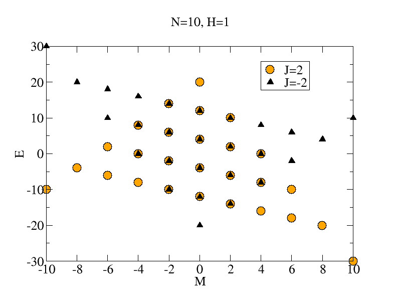
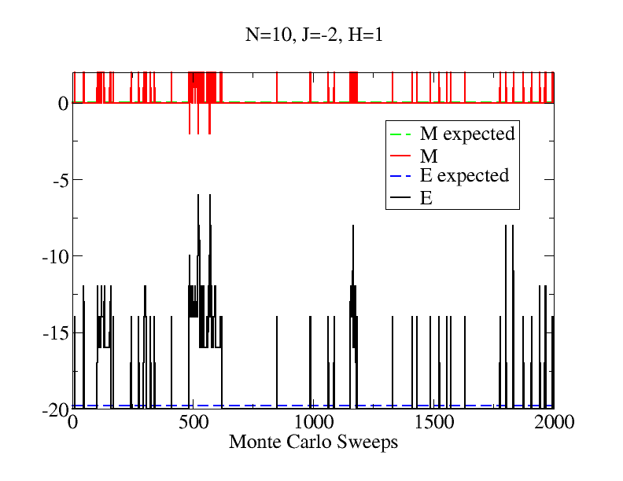
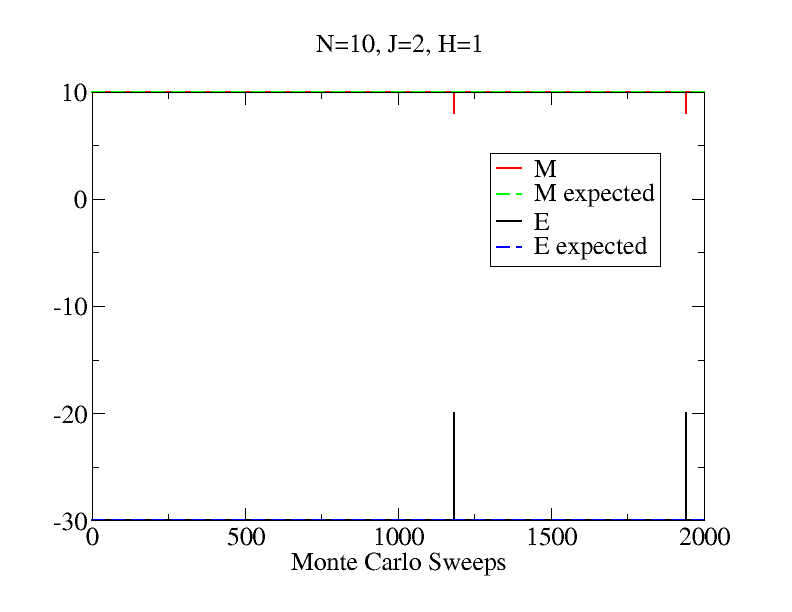

# Case study: N=10, J=2, H=1

Here we pick a 1D Ising model with 10 spins.
$$
E = -J\sum_{<i,j>}S_i S_j - H \sum_i S_i
$$
Both $J$ and $H$ are in the unit of $kT$, and periodic boundary condition is assumed.

To simplify notations, we label the ferromagnetic system 0 and anti-ferromagnetic system 1. Thus the free energy difference is
$$
\Delta F \equiv F_{J>0} - F_{J<0}= F_0 - F_1
$$

## Exact results

With 10 spins, the configuration space contains 1024 states, and it's trivial to compute exact solutions.

| quantity | ferromagnet (0)| anti-ferromagnet (1)|
| -------- | ----------- | ---------------- |
| U        | -29.99 | -19.76 |
| M        | 10.000 | 0.06 |
| F        | -30.00 | -20.73 |
| TS        | 0.006 | 0.97 |

Thus their free energy difference is $ \Delta F =-9.27 $.

With such choice of J and H, the ferromagnet almost stays at its ground state whereas the anti-ferromagnet is slightly excited.

The energy-magnetization relations can be seen in the next figure

## Sample individual system

We start from all spins up (ferromagnetic ground state) and perform 2000 Monte Carlo steps.

The standard deviation is computed as

$$
\Delta_O \simeq \sqrt{\frac{\overline{O^2} - \bar{O}^2}{N-1}}
$$

We can also estimate the partition function (thus free energy) directly

$$
F = -\frac{1}{\beta}\left<\exp(-\beta E)\right>
$$

Although this is know to be a bad idea.

The thermodynamic quantities estimated from the Monte Carlo samples are

| quantity | ferromagnet (0)| anti-ferromagnet (1)|
| -------- | ----------- | ---------------- |
| U        | $\pm$ | |
| M        | | |
| F        | | |
| TS        || |

We can apply the Zwanzig relation to get the free energy difference
$$
\Delta F = -\frac{1}{\beta}\log\left<\exp(-\beta\Delta H)\right>_1=\\
\Delta F = \frac{1}{\beta}\log\left<\exp(\beta\Delta H)\right>_0=
$$

## Sample J=H=0

## Combine two ensembles: BAR

